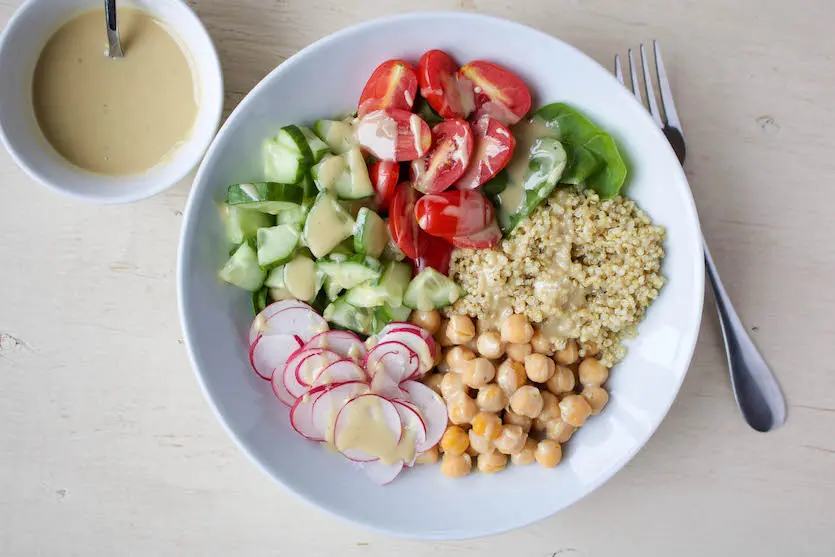

## Balanced Chickpea Buddha Bowl

1. Tomatoes (Carbohydrates)
1. Cucumber (Carbohydrates) 
1. Radish (Carbohydrates)
1. Chickpeas (Carbohydrates)
1. Quinoa (Protein)
1. Dressing (Fat)

Source: https://kaynutrition.com/well-balanced-meal-ideas/
