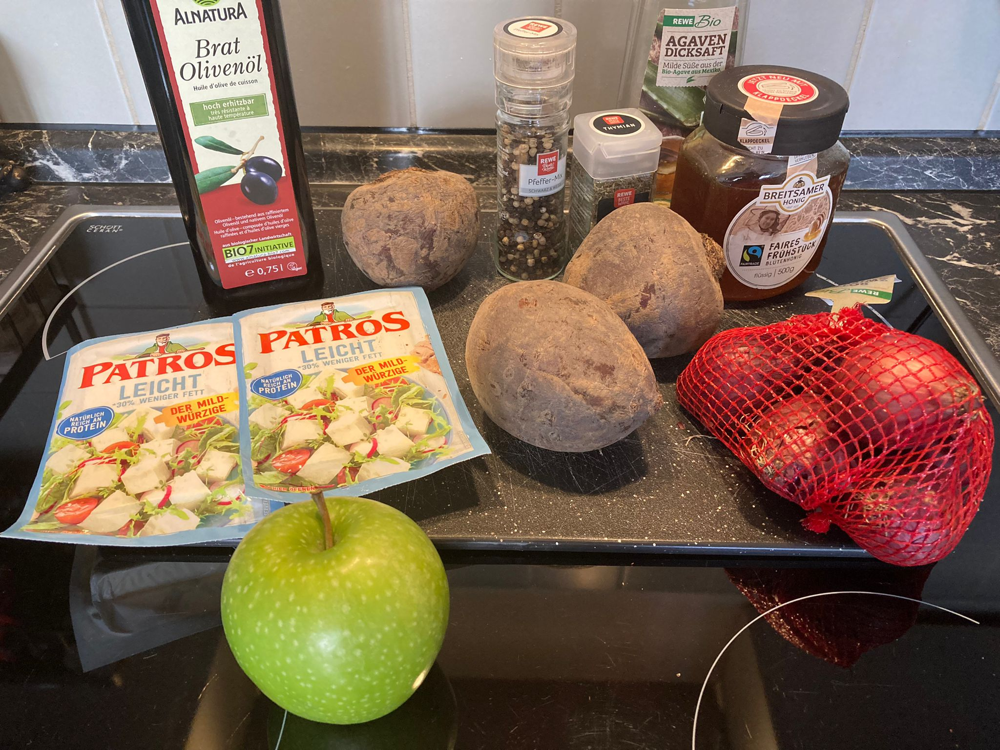
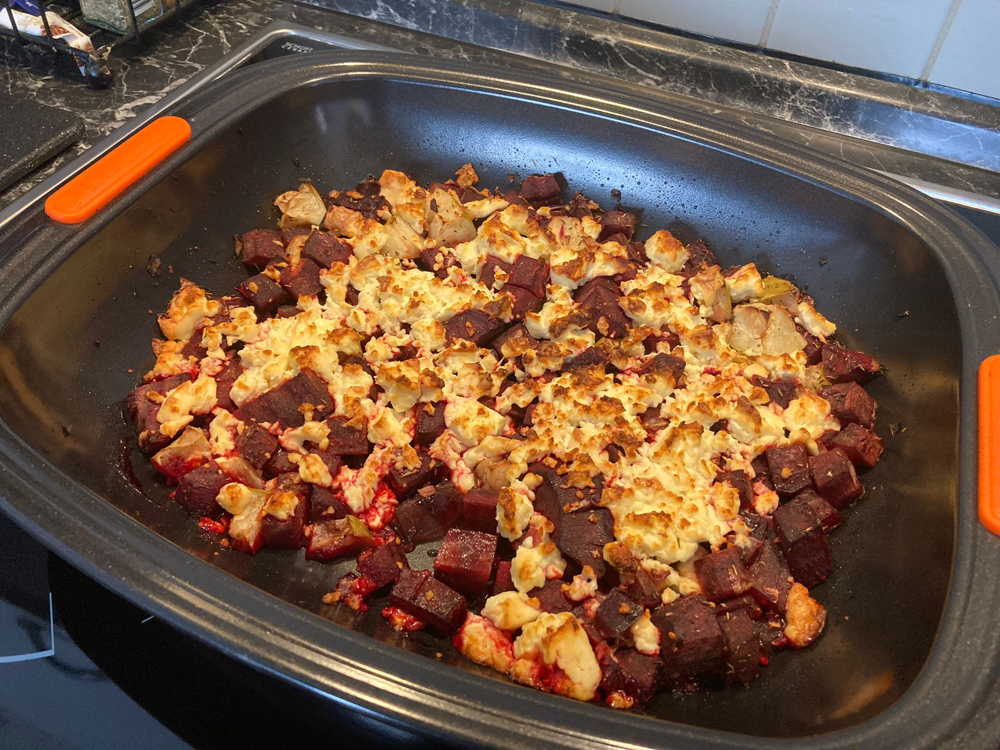

## Recipe

- Öl auf den Boden der Auflaufschale geben
- Rote Beete (am besten NICHT gekocht) in Auflaufform tun
- Thymian hinzugeben
- Apfel (sauer) dazu schneiden
- Pfeffer dazugeben
- Agavendicksaft oder Honig dazugeben
- 10 Minuten in den Ofen bei 200°C
- Schale rausnehmen, Feta reinbröseln
- Weitere 10 Minuten rein bei Oberhitze

## Ingredients

## Result

